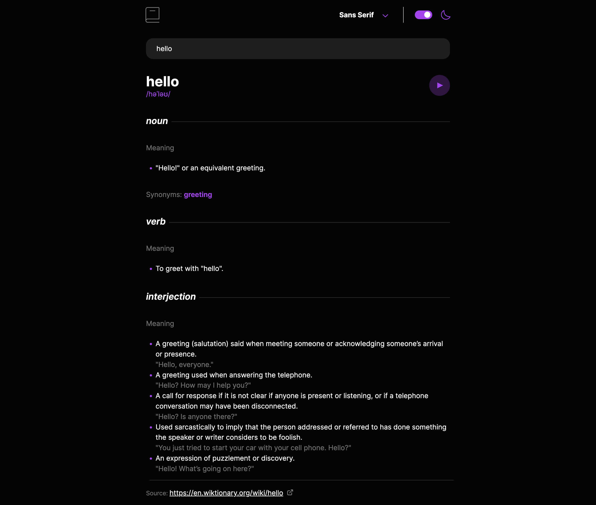

# Frontend Mentor - Dictionary web app solution

This is a solution to the [Dictionary web app challenge on Frontend Mentor](https://www.frontendmentor.io/challenges/dictionary-web-app-h5wwnyuKFL). Frontend Mentor challenges help you improve your coding skills by building realistic projects. 

## Table of contents

- [Overview](#overview)
  - [The challenge](#the-challenge)
  - [Screenshot](#screenshot)
  - [Links](#links)
- [My process](#my-process)
  - [Built with](#built-with)
  - [What I learned](#what-i-learned)
- [Author](#author)

## Overview

### The challenge

Users should be able to:

- Search for words using the input field
- See the Free Dictionary API's response for the searched word
- See a form validation message when trying to submit a blank form
- Play the audio file for a word when it's available
- Switch between serif, sans serif, and monospace fonts
- Switch between light and dark themes
- View the optimal layout for the interface depending on their device's screen size
- See hover and focus states for all interactive elements on the page
- **Bonus**: Have the correct color scheme chosen for them based on their computer preferences. _Hint_: Research `prefers-color-scheme` in CSS.

### Screenshot

### Links

- Solution URL: [Add solution URL here](https://github.com/Asendant/dictionary)
- Live Site URL: [Add live site URL here](https://asendant.github.io/dictionary/)

## My process
Step 1) Create project
Step 2) Begin creating structure for HTML navigation bar
Step 3) Style the navigation bar
Step 4) Add functionality using javascript to add theme changing and font style changing
Step 5) Add a search bar using HTML
Step 6) Style the search bar
Step 7) Add functionality by calling the free dictionary API with the value of the search bar
Step 8) Structure out the response given the template in Figma
Step 9) Style the now created response structure
Step 10) Using that response structure, create a dynamic response using javascript and the free dictionary api
Step 11) Add any last functionality such as link clicking and any last styling issues.

### Built with
- [HTML](https://html.com)
- [CSS](https://developer.mozilla.org/en-US/docs/Web/CSS)
- [Javascript](https://developer.mozilla.org/en-US/docs/Web/JavaScript)

### What I learned
During this project, I learned many things. These include the prefer-colors-scheme feature, dynamic generation with vanilla javascript, and how to fetch information from an API and then display that to the DOM. In addition, I learned how to create a manual drop down selection and theme selector features.

## Author

- Name - Jacob Althen
- Frontend Mentor - [@Asendent](https://www.frontendmentor.io/profile/Asendant)
- Github - [@Asendant](https://github.com/Asendant)
